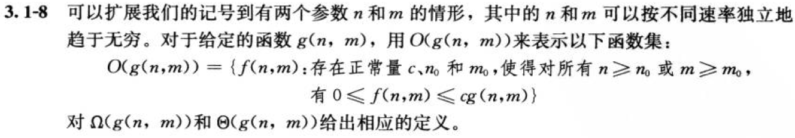

# 函数的增长

## 3.1-1

Q：假设$f(n)$与$g(n)$都是渐近非负函数。使用$\Theta$记号的基本定义来证明$max(f(n),g(n))=\Theta({f(n)+g(n)})$。

A：
证明存在正常量$c_1, c_2, n_0$，使得对所有$n\geq n_9$，有：
$$c_1f(n)+c_1g(n)\leq {max(f(n)+g(n))}\leq{c_2f(n)+c_2g(n)}$$
取$c_1$为1/4，$c_2$为2，且对于任意大的$n$，$f(n)$与$g(n)$都是渐近非负的，不论$max(f(n),g(n)) = f(n)/g(n)$取哪个，渐近符号定义的不等式都成立。

------------------------------------

## 3.1-2

Q：证明：对任意实常量$a$和$b$，其中$b>0$，有
$$(n+a)^b=\Theta{(n^b)} \tag{3.2}$$

A：

令$(n+a)\leq{2n}， 当|a|\leq n， (n+a) \geq {n/2}， 当|a|\leq {n/2}$

则有$n \geq{2a}$时，不等式$0 \leq {n/2} \leq {n+a} \leq {2n}$成立

对不等式乘幂b，得到$0 \leq {(n/2)^b} \leq {(n+a)^b} \leq{(2n)^b}$

则$c_1 = (1/2)^b, c_2 = 2^b, n_0 = 2a$时，得证。

------------------------------------

## 3.1-3

Q：解释为什么“算法A的运行时间至少是$\Omicron(n^2)$”这一表述是无意义的。

A：大O标记含义是指一个函数的上界，对于其包含函数，都要小于这个上界函数。当说运行时间至少是大O标记的函数时，相当于说运行时间的下界是其包含函数，即小于大O标记函数的任意函数，下界可以是一个任意小的函数时下界就没有意义了。

## 3.1-4

Q：$2^{n+1}=\Omicron(2^n)$成立吗？$2^{2n}=\Omicron(2^n)$成立吗？

A：前一个成立（$c_1=3，使2^{n+1}\leq{3\cdot{2^n}}$），后一个不成立。

## 3.1-5

Q：证明定理3.1。

A：

由$\omicron$定义可知，$0\leq{f(n)}\lt {cg(n)}$，对任意$c\gt 0$成立。
$$\lim\limits_{n \to \infty}{\frac{f(n)}{g(n)}} \lt{\lim\limits_{n \to \infty}{\frac{cg(n)}{g(n)}}} = c $$
因此$\lim\limits_{n \to \infty}{\frac{f(n)}{g(n)}} = 0$成立。

## 3.1-6

Q：证明：一个算法的运行时间为$\Theta(g(n))$当且仅当其最坏情况运行时间为$\Omicron(g(n))$，且其最好情况运行时间为$\Omega(g(n))$。

A：

算法运行时间为$\Theta(g(n))$，证：最坏情况运行时间为$\Omicron(g(n))$，且最好情况运行时间为$\Omega(g(n))$。

设$f(n)$为算法的运行时间函数，则有：
$$0\leq{c_1g(n)}\leq{f(n)}\leq{c_2g(n)}$$
最好情况运行时间为$c_1g(n)$，最坏情况运行时间为$c_2g(n)$。当$c\geq{c_2},c_2g(n)\leq{cg(n)}=\Omicron(g(n))$，最坏情况运行时间为$\Omicron(g(n))$，同理最好情况运行时间为$Ω(g(n))$

最坏情况运行时间为$\Omicron(g(n))$，且最好情况运行时间为$\Omega(g(n))$，证：算法运行时间为$\Theta(g(n))$。

设最好情况运行时间为$f_1(n)\leq{c_1g(n)}$，最坏情况运行时间为$f_2(n)\geq{c_2g(n)}$。有$c_2g(n)\leq{f_2(n)}\leq{f(n)}\leq{f_1(n)}\leq{c_1g(n)}$，则$f(n)=\Theta(g(n))$。

## 3.1-7

Q：证明：$\omicron(g(n))\cap{\omega(g(n))}$为空集。

A：设函数集$f_1(n)=\omicron(g(n))\lt{cg(n)}$，对任意$c\gt0$成立，函数集$f_2(n)=\omega(g(n))\gt{cg(n)}$，对任意$c\gt0$成立。由此对任意$c\gt0$，$f_1(n)\lt{cg(n)}\lt{f_2(n)}$，由此函数集$f_1(n)$与$f_2(n)$没有交集。

## 3.1-8

Q：

A：

$$\Omega(g(n,m))=\{f(n,m):存在正常量c,n_0和m_0，使得对所有n\geq{n_0}或m\geq{m_0}，有{f(n,m)}\geq{cg(n,m)}\geq{0}\}$$

$$\Theta(g(n,m))=\{f(n,m):存在正常量c_1,c_2,n_0和m_0，使得对所有n\geq{n_0}或m\geq{m_0}，有0\leq{c_1g(n,m)\leq{f(n,m)\leq{c_2g(n,m)}}}\}$$

## 3.2-1

Q：证明：若$f(n)$和$g(n)$是单调递增函数，则函数$f(n)+g(n)$和$f(g(n))$也是单调递增的，此外，若$f(n)$和$g(n)$是非负的，则$f(n)\cdot{g(n)}$是单调递增的。

A：

由$f(n)$和$g(n)$单调递增可得，对于$m_0\leq{m_1}$，有$f(m_0)\leq{f(m_1)},g(m_0)\leq{g(m_1)}$，对两不等式相加得$f(m_0)+g(m_0)\leq{f(m_1)+g(m_1)}$，所以$f(n)+g(n)$单调递增；对$f(m_0)\leq{f(m_1)}$，有$g(f(m_0))\leq{g(f(m_1))}$，所以$f(g(n))$单调递增。若$f(n)$和$g(n)$非负，有$f(n)\cdot{g(n)}\geq0$，因此$0\leq{f(m_0)g(m_0)}\leq{f(m_1)g(m_1)}$，$f(n)\cdot{g(n)}$是单调递增的。

## 3.2-2

Q：证明等式(3.16)。

A：$$\Huge{a^{\log_b{c}}=a^{\frac{\log_a{c}}{\log_a{b}}}=(a^{\log_a{c}})^{(1/\log_a{b})}=c^{(1/\log_a{b})}=c^{\log_b{a}}}$$

## 3.2-3

Q：证明等式(3.19)。并证明$n!=\omega(2^n)$且$n!=\omicron(n^n)$。

A：

## 3.2-4

n（不确定）

## 3.2-5

## 3.2-6

将两个数代入方程化简即可。

## 3.2-7

求黄金分割率以及它的共轭数的平方，该平方值即为黄金分割率值+1和它的共轭数+1的值，再用数学归纳法推导可得。

## 3.2-8
