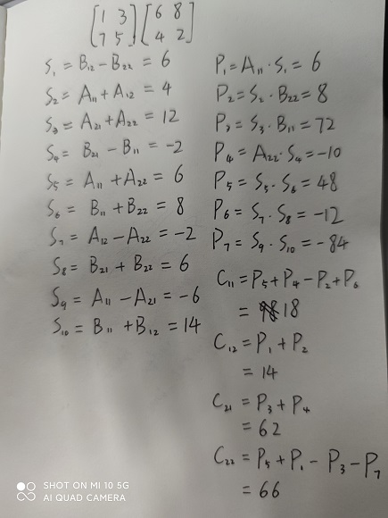
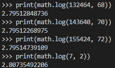
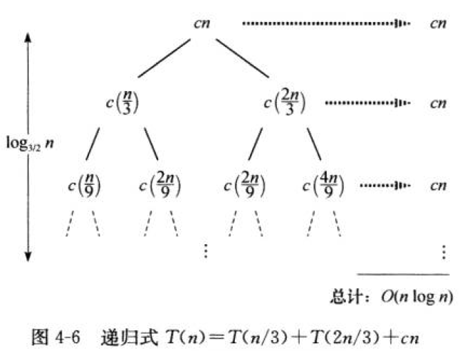

# 分治策略

## 4.1-1

Q：当A的所有元素均为负数时，FIND-MAXIMUM-SUBARRAY返回什么？

A：返回数组中最大的负数。

--------------------------------------

## 4.1-2

Q：对最大子数组问题，编写暴力求解方法的伪代码，其运行时间应该为$\Theta(n^2)$。

A：

```code
FIND-MAXIMUM-SUBARRAY-BRUTE(A, low, high):
    max = -INF
    left = low
    right = high
    for i = low to high
        sum = 0
        for j = i to high
            sum = sum + A[j]
            if sum > max
                max = sum
                left = i
                right = j
    return (left, right, max)
```

--------------------------------------

## 4.1-3

Q：在你的计算机上实现最大子数组问题的暴力算法和递归算法。请指出多大的问题规模$n_0$是性能交叉点————从此之后递归算法将击败暴力算法？然后，修改递归算法的基本情况————当问题规模小于$n_0$时采用暴力算法。修改后，性能交叉点会改变吗？

A：$n_0$在28，修改后性能交叉点变大为30。参考程序[A1_3.py](Resources/A1_3.py)。

--------------------------------------

## 4.1-4

Q：假定修改最大子数组问题的定义，允许结果为空子数组，其和为0。你应该如何修改现有算法，使它们能允许空子数组为最终结果？

A：当返回总值为负数时，返回空子数组（例如用 low > high 表示空子数组）。

--------------------------------------

## 4.1-5

Q：使用如下思想为最大子数组问题设计一个非递归的、线性时间的算法。从数组的左边界开始，由左至右处理，记录到目前为止已经处理过的最大子数组。若已知$A[1..j]$的最大子数组，基于如下性质将解扩展为$A[1..j+1]$的最大子数组：$A[1..j+1]$的最大子数组要么是$A[1..j]$的最大子数组，要么是某个子数组$A[i..j+1](1\leq{i}\leq{j+1})$。在已知$A[1..j]$的最大子数组的情况下，可以在线性时间内找出形如$A[i..j+1]$的最大子数组。

A：

```
FIND-MAXIMUM-SUBARRAY-LINEAR(A):
    n = A.length
    max_sum = -INF
    sum = -INF
    for j = 1 to n
        if sum > 0
            sum = sum + A[j]
        else
            current_low = j
            sum = A[j]
        if sum > max_sum
            max_sum = sum
            low = current_low
            high = j
    return (low, high, max_sum)
```

--------------------------------------

## 4.2-1

Q：使用Strassen算法计算如下矩阵乘法：
$$\begin{bmatrix}1 & 3 \\ 7 & 5\end{bmatrix}\begin{bmatrix}6 & 8 \\ 4 & 2\end{bmatrix}$$
给出计算过程。

A：


--------------------------------------

## 4.2-2

Q：为Strassen算法编写伪代码。

A：

```
SQUARE-MATRIX-MULTIPLY-STRASSEN(A, B):
    n = A.rows
    if n == 1
        return A_11 * B_11
    else 
        let C be a new n*n matrix
        partition A, B to 4 sub square matrix with n/2*n/2 elements
        S_1 = B_12 - B_22
        S_2 = A_11 + A_12
        S_3 = A_21 + A_22
        S_4 = B_21 - B_11
        S_5 = A_11 + A_22
        S_6 = B_11 + B_22
        S_7 = A_12 - A_22
        S_8 = B_21 + B_22
        S_9 = A_11 - A_21
        S_10 = B_11 + B_12
        P_1 = SQUARE-MATRIX-MULTIPLY-STRASSEN(A_11 , S_1)
        P_2 = SQUARE-MATRIX-MULTIPLY-STRASSEN(S_2 , B_22)
        P_3 = SQUARE-MATRIX-MULTIPLY-STRASSEN(S_3 , B_11)
        P_4 = SQUARE-MATRIX-MULTIPLY-STRASSEN(A_22 , S_4)
        P_5 = SQUARE-MATRIX-MULTIPLY-STRASSEN(S_5 , S_6)
        P_6 = SQUARE-MATRIX-MULTIPLY-STRASSEN(S_7 , S_8)
        P_7 = SQUARE-MATRIX-MULTIPLY-STRASSEN(S_9 , S_10)
        C_11 = P_5 + P_4 - P_2 + P_6
        C_12 = P_1 + P_2
        C_21 = P_3 + P_4
        C_22 = P_5 + P_1 - P_3 - P_7
        return C
```

--------------------------------------

## 4.2-3

Q：如何修改Strassen算法，使之适应矩阵规模$n$不是2的幂的情况？证明：算法的运行时间为$\Theta(n^{\lg7})$

A：对于矩阵规模不是2的幂的情况，扩充矩阵的行和列至一个大于$n$的2的幂，扩充的值均为0。通过Strassen算法计算该扩充矩阵，从左上角开始取一个大小为$n$的矩阵为结果。因为算法修改部分在开始和结束且花费$\Theta(n^2)$的处理时间，因此算法的运行时间为Strassen算法运行时间$\Theta(n^{\lg7})$。


--------------------------------------

## 4.2-4

Q：如果可以用$k$次乘法操作（假定乘法的交换律不成立）完成两个3 $\times$ 3矩阵相乘，那么你可以在$\omicron(n^{\lg7})$时间内完成n $\times$ n矩阵相乘，满足这一条件的最大的$k$是多少？此算法的运行时间是怎样的？

A：$\log_3{k}\lt{\log_2{7}}$，推得$k\lt{7^{\lg3}}\approx{22}$，因此满足这一条件的最大的$k=21$。此算法的运行时间为$\Theta(n^{\log_3{21}})$。

--------------------------------------

## 4.2-5

Q：V.Pan发现一种方法，可以用132464次乘法操作完成68 $\times$ 68的矩阵相乘，发现另一种方法，可以用143640次乘法操作完成 70 $\times$ 70 的矩阵相乘，还发现一种方法，可以用155424次乘法操作完成 72 $\times$ 72 的矩阵相乘。当用于矩阵相乘的分治算法时，上述哪种方法会得到最佳的渐近运行时间？与Strassen算法相比，性能如何？

A：




--------------------------------------

## 4.2-6

Q：用Strassen算法作为子进程来进行一个$kn \times n$矩阵和一个$n \times kn$矩阵相乘，最快需要花费多长时间？对两个输入矩阵规模互换的情况，回答相同的问题。

A：$n^{k\lg7}$和$kn^{\lg7}$。

--------------------------------------

## 4.2-7

Q：设计算法，仅使用三次实数乘法即可完成复数$a+bi$和$c+di$相乘。算法需接收$a、b、c和d$为输入，分别生成实部$ac-bd$和虚部$ad+bc$。

A：分别计算$(a + b)d, (c + d)a, (a - b)c$；有$(ac - bd) = (c + d)a - (a + b)d$，且$(ad + bc) = (c + d)a - (a - b)c$。

--------------------------------------

## 4.3-1

Q：证明：$T(n)=T(n-1)+n$的解为$\Omicron(n^2)$。

A：

$T(n)=T(n-1)+n$

$T(n-1)=T(n-2)+n-1$

$...$

$T(2)=T(1)+2$

将以上式子累加得$T(n)=T(1)+2+...+n$，令$T(1)=c$，$T(n)=1/2n^2+1/2n+c-1=\Omicron(n^2)$

--------------------------------------

## 4.3-2

Q：证明：$T(n)=T(\lceil{n/2}\rceil) + 1$的解为$\Omicron(\lg{n})$。

A：

$T(n) \le c\lg{\lceil{n/2}\rceil} + 1$

$\le c\lg(\frac{n}{2} + 1) + 1$

$=c\lg(\frac{n}{2}\frac{n+2}{n}) + 1$

$=c\lg{n} - c + c\lg{\frac{n+2}{n}} + 1$

$\le c\lg{n} - c + c\lg{\frac{5}{3}} + 1 (n\ge3)$

$\le c\lg{n} (c \ge (1-\lg{\frac{5}{3}})^{-1})$

--------------------------------------

## 4.3-3

Q：我们看到$T(n)=2T(\lfloor{n/2}\rfloor)+n$的解为$\Omicron(n\lg{n})$。证明$\Omega(n\lg{n})$也是这个递归式的解。从而得出结论：解为$\Theta(n\lg{n})$。

A：

假设$T(n)\geq c(n+2)\lg{(n+2)}$，则

$T(n)\geq 2c(\lfloor{n/2}\rfloor+2)\lg(\lfloor{n/2}\rfloor + 2)+n$

$\geq 2c(n/2 - 1 + 2)\lg(n/2-1+2) + n$

$= 2c \frac{n+2}{2}\lg{\frac{n+2}{2}} + n$

$=c(n+2)\lg(n+2)-c(n+2)\lg2+n$

$=c(n+2)\lg(n+2)+(1-c)n-2c$

$\geq c(n+2)\lg(n+2)$，当$n\geq {\frac{2c}{1-c}},0\leq{c}\lt1$成立

--------------------------------------

## 4.3-4

Q：证明：通过做出不同的归纳假设，我们不必调整归纳证明中的边界条件，即可克服递归式(4.19)中边界条件$T(1)=1$带来的困难。

A：

假设$T(n)\leq cn\lg{n} + n$，则

$T(n)\leq 2(c\lfloor{n/2}\rfloor\lg{\lfloor{n/2\rfloor+\lfloor{n/2}\rfloor})+n}$

$\leq 2c(n/2)\lg(n/2)+2(n/2)+n$

$= cn\lg(n/2)+2n$

$= cn\lg n - cn + 2n$

$\leq  cn\lg n + n$，当$c\geq 1$成立。此时边界条件$T(1)=1\leq cn\lg n + n = 0+1=1$也成立。

--------------------------------------

## 4.3-5

Q：证明：归并排序的“严格”递归式(4.3)的解为$\Theta(n\lg n)$

A：

证明(4.3)满足$T(n)\leq c(n-2)\lg(n-2)$

$T(n)\leq c(\lceil{n/2}\rceil-2)\lg(\lceil{n/2}\rceil-2)+c(\lfloor{n/2}\rfloor-2)\lg(\lfloor{n/2}\rfloor-2)+kn$

$\leq c(n/2+1-2)\lg(n/2+1-2)+c(n/2-1)\lg(n/2-1)+kn$

$= 2c(n/2-1)\lg(n/2-1)+kn$

$= c(n-2)\lg(n-2)+2c+(k-c)n$

$\leq c(n-2)\lg(n-2)$，当$c\gt k$时成立。有$T(n)=\Omicron(n\lg n)$。

证明(4.3)满足$T(n)\geq c(n+2)\lg(n+2)$

$T(n)\geq c(\lceil{n/2}\rceil+2)\lg(\lceil{n/2}\rceil+2)+c(\lfloor{n/2}\rfloor+2)\lg(\lfloor{n/2}\rfloor+2)+kn$

$\geq c(n/2-1+2)\lg(n/2-1+2)+c(n/2+1)\lg(n/2+1)+kn$

$=2c(n/2+1)\lg(n/2+1)+kn$

$=c(n+2)\lg(n+2)-2c+(k-c)n$

$\geq c(n+2)\lg(n+2)$，当$c\lt k$时成立。有$T(n)=\Omega(n\lg n)$。

因此(4.3)的解为$\Theta(n\lg n)$。

--------------------------------------

## 4.3-6

Q：证明：$T(n)=2T(\lfloor{n/2}\rfloor + 17)+n$的解为$\Omicron(n\lg n)$。

A：证明$T(n)\leq c(n-a)\lg(n-a)$

$T(n)\leq 2c(\lfloor{n/2}\rfloor + 17-a)\lg(\lfloor{n/2}\rfloor+17-a)+n$

$\leq 2c(n/2 + 1 + 17 - a)\lg(n/2 + 1 + 17 -a) + n$

$= 2c(\frac{n+36-2a}{2})\lg(\frac{n+36-2a}{2})+n$

$= c(n+36-2a)\lg(n+36-2a)-c(n+36-2a)+n$

$\leq c(n-a)\lg(n-a)$，当$c>1,a>36$时成立。因此$T(n)$的解为$\Omicron(n\lg n)$。

--------------------------------------

## 4.3-7

Q：使用4.5节中的主方法，可以证明$T(n)=4T(n/3)+n$的解为$T(n)=\Theta(n^{\log_3{4}})$。说明基于假设$T(n)\leq cn^{\log_3{4}}$的代入法不能证明这一结论。然后说明如何通过减去一个低阶项完成代入法证明。

A：代入法无法消除$T(n)=4T(n/3)+n$中的$n$项。因此可以假设$T(n)\leq cn^{\log_3{4}}-3/4n$，代入得

$T(n)\leq 4(c(n/3)^{\log_3{4}}-3/4(n/3))+n$

$\leq cn^{\log_3{4}}-n+n \leq cn^{\log_3{4}}$，得证。

--------------------------------------

## 4.3-8

Q：使用4.5节中得主方法，可以证明$T(n)=4T(n/2)+n$的解为$T(n)=\Theta(n^2)$。说明基于假设$T(n)\leq cn^2$的代入法不能证明这一结论。然后说明如何通过减去一个低阶项完成代入法证明。

A：假设$T(n)\leq cn^2-n/2$

$T(n)\leq 4(c(n/2)^2-n/4)+n$

$\leq cn^2$，得证。

--------------------------------------

## 4.3-9

Q：利用改变变量的方法求解递归式$T(n)=3T(\sqrt n)+\log n$。你的解应该是渐近紧确的。不必担心数值是否是整数。

A：将$n=2^m$代入递归式得$T(2^m)=3T(2^{m/2})+m$，$S(m)=T(2^m)$推得$S(m)=3S(m/2)+m$，根据主方法有$T(n)=T(2^m)=S(m)=\Omicron(m^{\lg 3})=\Omicron((\lg n)^{\lg 3})$。

--------------------------------------

## 4.4-1

Q：对递归式$T(n)=3T(\lfloor{n/2}\rfloor)+n$，利用递归树确定一个好的渐近上界，用代入法进行验证。

A：递归式$T(n)=3T(\lfloor{n/2}\rfloor)+n$对于第$i$层的子问题规模为$n/2^i$，每层结点递增3，深度为$\lg n$，叶结点总数为$n^{\lg 3}$。因此有

$T(n)=n+\frac{3}{2}n+(\frac{3}{2})^{2}n+...+(\frac{3}{2})^{\lg {n} - 1}n+\Theta(n^{\lg 3})$

$=\sum_{i=0}^{\lg {n} - 1}(3/2)^in+\Theta(n^{\lg 3})$

$=n\frac{(3/2)^{\lg{n}} - 1}{3/2 - 1} + \Theta(n^{\lg 3})$

$=2n(n^{\lg(3/2)}-1)+\Theta(n^{\lg 3})$

$= 2n^{\lg3}-2n+\Theta(n^{\lg 3})$

$=\Omicron(n^{\lg 3})$

将$T(n) \leq cn^{\lg 3} - dn$代入递归式得

$T(n)\leq 3(c(\lfloor{n/2}\rfloor)^{\lg3} - d\lfloor{n/2}\rfloor)+n$

$\leq 3(c(n/2)^{\lg 3}-dn / 2)+n$

$= cn ^{\lg 3}-dn+(1-1/2d)n$

$\leq cn^{\lg 3}-dn$，对$d\geq 2$成立。

--------------------------------------

## 4.4-2

Q：对递归式$T(n)=T(n/2)+n^2$，利用递归树确定一个好的渐近上界，用代入法进行验证。

A：递归式$T(n)=T(n/2)+n^2$对于第$i$层的子问题规模为$n/2^i$，每层结点数均为1，深度为$\lg n$，叶结点总数为1。因此有

$T(n)=n^2+n^2/4+n^2/16+...+n^2/4^{\lg n}+\Theta(1)$

$= 4/3n^2-4/3+\Theta(1)$

$=\Theta(n^2)$

将$T(n)\leq cn^2$代入递归式得

$T(n)\leq c(n/2)^2+n^2$

$=(c/4+1)n^2$

$\leq cn^2$，对$c \geq 4/3$成立。

--------------------------------------

## 4.4-3

Q：对递归式$T(n)=4T(n/2+2)+n$，利用递归树确定一个好的渐近上界，用代入法进行验证。

A：递归式$T(n)=4T(n/2+2)+n$对于第$i$层的子问题规模为$\frac{n+4(2^i-1)}{2^i}$，每层结点递增4，深度为$\lg n$，叶结点总数为$n^2$。因此有

$T(n)=\sum_{i=0}^{\lg n - 1}{\frac{n+4(2^i-1)}{2^i}\cdot 4^i} + \Theta(n^2)$

$=\sum_{i=0}^{\lg n - 1}{2^in+4\cdot{2^i}(2^i - 1)}+\Theta(n^2)$

$=n\frac{2^{\lg n} - 1}{2 - 1}+\sum_{i=0}^{\lg n - 1}4\cdot{2^i}(2^i - 1)+\Theta(n^2)$

$=n^2-n+4(\frac{4^{\lg n} - 1}{3}-(2^{\lg n} - 1))+\Theta(n^2)$

$= n ^2-n+4/3n^2-4n+8/3+\Theta(n^2)$

$= 7/3n^2 - 5n + 8/3 + \Theta(n^2)$

$= \Omicron(n^2)$

将$T(n)\leq c(n^2 - dn)$代入递归式得

$T(n)\leq 4(c((n/2+2)^2-d(n/2+2))) + n$

$=cn^2+8cn+16c-2cdn-8cd+n$

$=c(n^2-dn)+(8c-cd+1)n+(16-8d)c$

$\leq c(n^2-dn)$，对于$8c-cd + 1 \leq 0$成立。

--------------------------------------

## 4.4-4

Q：对递归式$T(n)=T(n-1)+1$，利用递归树确定一个好的渐近上界，用代入法进行验证。

A：递归式$T(n)=T(n-1)+1$对于第$i$层的子问题规模为1，每层结点均为1，深度为$n$，叶结点总数为1。因此有

$T(n)=n+\Theta(1) = \Theta(n)$

将$T(n)\leq cn$代入递归式得

$T(n)\leq cn+1-c\leq cn$，对于$c\geq1$成立。

--------------------------------------

## 4.4-5

Q：对递归式$T(n)=T(n-1)+T(n/2)+n$，利用递归树确定一个好的渐近上界，用代入法进行验证。

--------------------------------------

## 4.4-6

Q：对递归式$T(n)=T(n/3)+T(2n/3)+cn$，利用递归树论证其解为$\Omega(n\lg n)$，其中$c$为常数。

A：



每层总数为cn，最低的树高出现在树左侧为$\log_3{n}$，因此从递归树推测递归式$T(n)\geq cn\log_3{n}\gt cn\lg n$，因此$T(n)=\Omega(n\lg n)$。

--------------------------------------

## 4.4-7

Q：对递归式$T(n)=4T(\lfloor{n/2}\rfloor)+cn$（c为常数），画出递归树，并给出其解的一个渐近紧确界。用代入法进行验证。

A：递归式$T(n)=4T(\lfloor{n/2}\rfloor)+cn$对于第$i$层子问题规模为$n/2^i$，每层结点递增4，深度为$\lg n$，叶结点总数为$n^2$。因此有

$T(n)=\sum_{i=0}^{\lg n - 1}2^icn+\Theta(n^2)$

$=cn^2-cn+\Theta(n^2)=\Theta(n^2)$

对于$\Omicron(n^2)$，证明$T(n)\leq dn^2-cn$

$T(n)\leq 4d(n/2)^2-4c(n/2)+cn=dn^2-cn$

对于$\Omega(n^2)$，证明$T(n)\geq dn^2-cn$

$T(n)\geq 4d(n/2)^2-4c(n/2)+cn=dn^2-cn$

--------------------------------------

## 4.4-8

Q：对递归式$T(n)=T(n-a)+T(a)+cn$，利用递归树给出一个渐近紧确解，其中$a\geq 1$和$c>0$是常数。

A：递归式$T(n)=T(n-a)+T(a)+cn$对于第$i$层子问题规模为$cn-ica$，每层结点均为1，深度为$n/a$，叶结点总数为1。因此有

$T(n)=\sum_{i=0}^{n/a}{c(n-ia)}+(n/a)ca$

$=\sum_{i=0}^{n/a}{cn-\sum_{i=0}^{n/a}{cia}}+nc$

$=cn^2/a - \Theta(n^2)+\Theta(n)$

$=\Theta(n^2)$

对于$\Omicron(n^2)$，证明$T(n)\leq cn^2$

$T(n)\leq c(n-a)^2+ca^2+cn$

$= cn^2-2cna+2ca^2+cn$

$= cn^2-c(2an-2a^2-n)$

$\leq cn^2 - cn$

$\leq cn^2$，当$a\gt2,n>2a$时成立

对于$\Omega(n^2)$，证明$T(n)\geq cn^2$，过程同上，当$a\lt2,n>2a$时成立。

--------------------------------------

## 4.4-9

Q：对递归式$T(n)=T(\alpha n)+T((1-\alpha)n)+cn$，利用递归树给出一个渐近紧确解，其中$0<\alpha<1$和$c>0$是常数。

A：递归式$T(n)=T(\alpha n)+T((1-\alpha)n)+cn$对于第$i$层子问题总规模为$cn(\alpha+(1-\alpha))^i$，深度为$\lg n$，叶结点总数为$n$。因此有

$T(n)=cn\lg n + \Theta(n)=\Theta(n\lg n)$

对于$\Omicron(n\lg n)$，证明$T(n)\leq c(n\lg n - dn)$

$T(n)\leq c(\alpha n\lg {\alpha n}-d\alpha n)+c((1-\alpha) n\lg {(1-\alpha) n}-d(1-\alpha) n)+cn$

$= c\alpha n\lg {\alpha n}-cd\alpha n+cn\lg{(1-\alpha)n}-c\alpha n\lg{(1-\alpha)n}-cdn+c\alpha n+cn$

$= c\alpha n\lg {\alpha}+c\alpha n\lg n - cd\alpha n+cn\lg{(1-\alpha)}+cn\lg n-c\alpha n\lg(1-\alpha)-c\alpha n\lg n-cdn+c\alpha n+cn$

$=cn\lg n - cdn + c\alpha n\lg{\frac{\alpha}{1-\alpha}}+cn\lg(1-\alpha)+(\alpha + 1 - d\alpha)n$

$\leq cn\lg n -cdn$，当$\alpha \leq 1/2,d > 1+ 1/\alpha$时成立。

对于$\Omega(n\lg n)$，证明$T(n)\geq c(n\lg n-dn)$，推导同上，当$0 < d < \frac{c\alpha \lg {\alpha}+c(1-\alpha) \lg(1-\alpha)+\alpha + 1}{\alpha}$时成立。

--------------------------------------

## 4.5-1

Q：对下列递归式，使用主方法求出渐近紧确界。

A：

a. $T(n)=2T(n/4)+1$

我们有$a=2,b=4,f(n)=\Theta(1)$，因此$n^{\log_b{a}}=n^{1/2}$，由于对$\epsilon = 1/2$，有$f(n)=\Omicron(n^{1/2-\epsilon})$，应用情况1，得到解$T(n)=\Theta(\sqrt n)$。

b. $T(n)=2T(n/4)+\sqrt n$

我们有$a=2,b=4,f(n)=\Theta(\sqrt n)$，因此$n^{\log_b{a}}=n^{1/2}$，有$f(n)=\Theta(\sqrt n)=\Theta(n^{\log_b{a}})$，应用情况2，得到解$T(n)=\Theta(\sqrt n \lg n)$。

c. $T(n)=2T(n/4) + n$

我们有$a=2,b=4,f(n)=\Theta(n)$，由于对$\epsilon=1/2$，有$f(n)=\Omega(n^{1/2+\epsilon})$，且对常数$c=2$和所有足够大的$n$有$af(n/b)=2f(n/4)\leq 2f(n)$，应用情况3，得到解$T(n)=\Theta(n)$。

d. $T(n)=2T(n/4)+n^2$

我们有$a=2,b=4,f(n)=\Theta(n^2)$，$n^{\log_b{a}}=\sqrt n$，由于对$\epsilon=3/2$，有$f(n)=\Omega(n^{1/2+\epsilon})$，且对常数$c=2$和所有足够大的$n$有$af(n/b)=2f(n/4)\leq 2f(n)$，应用情况3，得到解$T(n)=\Theta(n^2)$。

--------------------------------------

## 4.5-2

Q：Caesar教授想设计一个渐近快于Strassen算法的矩阵相乘算法。他的算法使用分治方法，将每个矩阵分解为$n/4 \times n/4$的子矩阵，分解和合并步骤共花费$\Theta(n^2)$时间。他需要确定，他的算法需要创建多少个子问题，才能击败Strassen算法。如果他的算法创建$a$个子问题，则描述运行时间$T(n)$的递归式为$T(n)=aT(n/4)+\Theta(n^2)$。Caesar教授的算法如果要渐近快于Strassen算法，$a$的最大整数值应是多少？

A：解不等式$\lg 7 \lt \log_4 a$，推得$a\lt 7^2$，因此$a$的最大整数值应是48。

--------------------------------------

## 4.5-3

Q：使用主方法证明：二分查找递归式$T(n)=T(n/2)+\Theta(1)$的解是$T(n)=\Theta(\lg n)$。（二分查找的描述见练习 2.3-5）。

A：递归式$T(n)=T(n/2)+\Theta(1)$，$a=1,b=2,f(n)=\Theta(1)$，因此有$n^{\log_b{a}}=1=f(n)$，应用情况2，得到解$T(n)=\Theta(\lg n)$。

--------------------------------------

## 4.5-4

Q：主方法能应用于递归式$T(n)=4T(n/2)+n^2\lg n$吗？请说明为什么可以或者为什么不可以。给出这个递归式的一个渐近上界。

A：不可以应用主方法，因为$f(n)=n^2\lg n=\Omega(n^{\lg 4})$，但不是多项式意义上的大于，即不存在常数$\epsilon\gt 0$，有$f(n)=\Omega(n^{2+\epsilon})$。

证明$T(n)=\Omicron(n^2\lg^2n)$，即$T(n)\leq cn^2\lg^2n$

$T(n)\leq 4c(n/2)^2\lg^2(n/2)+n^2\lg n$

$=cn^2(\lg n - 1)^2+n^2\lg n$

$=cn^2\lg^2n+n^2(c+(1-2c)\lg n)$

$\leq cn^2\lg^2n$，当$c>1/2$时成立。

--------------------------------------

## 4.5-5

Q：考虑主定理情况3的一部分：对某个常数$c<1$，正则条件$af(n/b)\leq cf(n)$是否成立。给出一个例子，其中常数$a\geq 1,b>1$且函数$f(n)$满足主定理情况3中除正则条件外的所有条件。

--------------------------------------

## 思考题4-1

Q：（递归式例子）对下列每个递归式，给出$T(n)$的渐近上界和下界。假定$n\leq 2$时$T(n)$是常数。给出尽量紧确的界，并验证其正确性。

A：

a. $T(n)=2T(n/2)+n^4$

根据主定理满足情况3，因此$T(n)=\Theta(n^4)$。

b. $T(n)=T(7n/10)+n$

根据主定理满足情况3，因此$T(n)=\Theta(n)$。

c. $T(n)=16T(n/4)+n^2$

根据主定理满足情况2，因此$T(n)=\Theta(n^2)$。

d. $T(n)=7T(n/3)+n^2$

根据主定理满足情况3，因此$T(n)=\Theta(n^2)$。

e. $T(n)=7T(n/2)+n^2$

根据主定理满足情况1，因此$T(n)=\Theta(n^{\lg 7})$。

f. $T(n)=2T(n/4)+\sqrt n$

根据主定理满足情况2，因此$T(n)=\sqrt n$。

g. $T(n)=T(n-2)+n^2$

猜测解为$\Theta(n^3)$，验证$T(n)=\Omicron(n^3)$和$T(n)=\Omega(n^3)$，下面仅验证$T(n)=\Omicron(n^3)$，另一个同理。

$T(n)\leq c(n-2)^3+n^2$

$=c(n^3-6n^2+12n-8)+n^2$

$=cn^3+(1-6c)n^2+12n-8$

$\leq cn^3$，当$c>13/6$时成立。

--------------------------------------

## 思考题4-2

Q：（参数传递代价）我们有一个贯穿本书的假设————过程调用中的参数传递花费常量时间，即使传递一个N个元素的数组也是如此。在大多数系统中，这个假设是成立的，因为传递的是指向数组的指针，而非数组本身。本题讨论三种参数传递策略：
1. 数组通过指针来传递。时间$=\Theta(1)$。
2. 数组通过元素复制来传递。时间$=\Theta(N)$，其中N是数组的规模。
3. 传递数组时，只复制过程可能访问的子区域。若子数组$A[p..q]$被传递，则时间$=\Theta(q-p+1)$。

A：

a. 考虑在有序数组中查找元素的递归二分查找算法（参见练习2.3-5）。分别给出上述三种参数传递策略下，二分查找最坏情况运行时间的递归式，并给出递归式解的好的上界。令N为原问题的规模，$n$为子问题的规模。

1. $T(n)=T(n/2)+\Theta(1)$，根据主定理情况2解为$\Theta(\lg n)$。
2. $T(n)=T(n/2)+\Theta(N)$

    $=T(n/2)+cN$
   
   $=T(n/4)+2cN$

    $...$

   $=cN\lg n$

   $=\Theta(n\lg n)$
3. $T(n)=T(n/2)+\Theta(n)$，根据主定理情况3解为$\Theta(n)$。

b. 对2.3.1节的MERGE-SORT算法重做(a)。

1. $T(n)=2T(n/2)+\Theta(n)+c$，根据主定理情况2解为$\Theta(n\lg n)$。
2. $T(n)=2T(n/2)+cn+2N$，根据递归树猜测解为$\Omicron(n\lg^2n)$。

    证明$T(n)\leq c(n\lg^2{n}+dn)$

    $T(n)\leq 2(c(\frac{n}{2}\lg^2(n/2)+dn/2))+cn+2N$

    $=cn\lg^2(n/2)+cdn+cn+2N$

    $=cn(\lg n-1)^2+cdn+cn+2N$

    $=cn\lg^2 n-2cn\lg n+cn+cdn+cn+2N$

    $=c(n\lg^2 n+dn)+2cn+2N-2cn\lg n$

    $\leq c(n\lg^2 n +dn)$，当$c>1,n>2$时成立。
    
3. $T(n)=2T(n/2)+\Theta(n)+2n/2$，根据主定理情况2解为$\Theta(n\lg n)$。

--------------------------------------

## 思考题4-3

Q：（更多得递归式例子）对下列每个递归式，给出$T(n)$的渐近上界和下界。假定对足够小的$n$，$T(n)$是常数。给出尽量紧确的界，并验证其正确性。

A：

a. $T(n)=4T(n/3)+n\lg n$

根据主定理情况1，解为$\Theta(n^{\log_3{4}})$。

b. $T(n)=3T(n/3)+n/\lg n$

c. $T(n)=4T(n/2)+n^2\sqrt n$

根据主定理情况3，解为$\Theta(n^2\sqrt n)$。

d. $T(n)=3T(n/3-2)+n/2$

$T(n/3-2)$中的-2可以剔除，因为对于足够大的$n$，常数项的改变与除法相比可以忽略。因此根据主定理2，解为$\Theta(n\lg n)$。

e. $T(n)=2T(n/2)+n/\lg n$

f. $T(n)=T(n/2)+T(n/4)+T(n/8)+n$

猜测解$T(n)=\Theta(n)$

证明$T(n)\leq cn$

$T(n)\leq cn/2 + cn/4+cn/8+n$

$\leq \frac{7}{8}cn + n \leq cn$，当$c \geq 8$时成立。

同理可证$T(n)\geq cn$，当$c \leq 8$时成立。

g. $T(n)=T(n-1)+1/n$

根据递归树有和式$T(n)=1+1/2+...+1/(n-1)+1/n$

$T(n)=(1+1/n)+(1/2+1/(n-1))... \leq n/2\cdot (n+1)/n=(n+1)/2$

猜测递归式的解为$\Theta(n)$

证明$T(n)\leq cn$，代入得

$T(n)\leq c(n-1)+1/n=cn-c+1/n$

$\leq cn$，当$c\geq 1$时成立。

同理可证$T(n)\geq c(n-1/n)$，当$c\geq 1$时成立。

h. $T(n)=T(n-1)+\lg n$

根据递归树有和式$T(n)=\lg n + \lg (n-1)+\lg (n-2)+...+\lg 1=\lg n!=\Theta(n\lg n)$。

i. $T(n)=T(n-2)+1/\lg n$

j. $T(n)=\sqrt nT(\sqrt n)+n$
