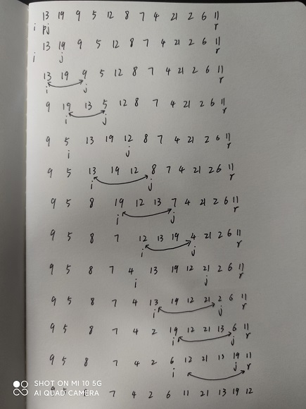
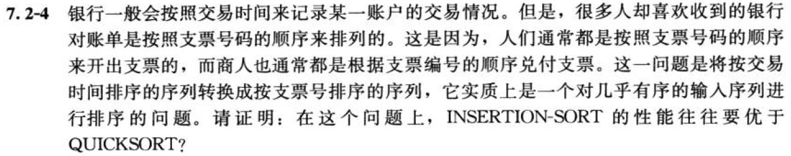

# 快速排序

## 7.1-1

Q：参照图7-1的方法，说明PARTITION在数组A=<13, 19, 9, 5, 12, 8, 7, 4, 21, 2, 6, 11>上的操作过程。

A：



------------------------------

## 7.1-2

Q：当数组$A[p..r]$中的元素都相同时，PARTITION返回的q值是什么？修改PARTITION，使得当数组$A[p..r]$中所有元素的值都相同时，$q=\lfloor{(p+r)/2}\rfloor$。

A：

当元素都相同时返回的q值是r。

```code
PARTITION(A, p, r)
    x = A[r]
    i = p - 1
    all-equal = true
    for j = p to r - 1
        if A[j] != x
            all-equal = false
        if A[j] <= x
            i = i + 1
            exchange A[i] with A[j]
    exchange A[i + 1] with A[r]
    if all-equal
        return floor((p + r) / 2)
    else
        return i + 1
```

------------------------------

## 7.1-3

Q：请简要地证明：在规模为$n$的子数组上，PARTITION的时间复杂度为$\Theta(n)$。

A：for循环对每个元素操作一次，其他均为常数时间，因此时间复杂度为$\Theta(n)$。

------------------------------

## 7.1-4

Q：如何修改QUICKSORT，使得它能够以非递增序进行排序？

A：将PARTITION第4行的$\leq$改为$\geq$。

------------------------------

## 7.2-1

Q：利用代入法证明：正如7.2节开头提到的那样，递归式$T(n)=T(n-1)+\Theta(n)$的解为$T(n)=\Theta(n^2)$。

A：证明$T(n)=\Omicron(n^2)$，将$T(n)\leq cn^2$代入递归式得

$T(n)\leq c(n-1)^2+n$

$= cn^2+n(1-2c) + c$

$\leq cn^2$，当$c>1/2$时成立。

同理可证$T(n)\geq cn^2$，当$c< 1/2$时成立。

------------------------------

## 7.2-2

Q：当数组A的所有元素都具有相同值时，QUICKSORT的时间复杂度是什么？

A：每次划分结果都是大小为$0和n-1$的子数组，因此时间复杂度为$\Omicron(n^2)$。

------------------------------

## 7.2-3

Q：证明：当数组A包含的元素不同，并且是按降序排列的时候，QUICKSORT的时间复杂度为$\Theta(n^2)$。

A：由于数组A包含的元素不同，并且已按照降序排列。每次PARTITION过程得到两个不平衡$(n - 1 : 0)$的子数组，PARTITION过程需要$\Theta(n)$，将会有$n$次PARTITION过程，因此QUICKSORT的时间复杂度为$\Theta(n^2)$。

------------------------------

## 7.2-4

Q：



A：INSERTION-SORT对几乎有序的输入序列排序，在遍历过程中，基本不会发生元素的移动，因此时间复杂度为$\Omicron(n)$；而QUICKSORT对该序列排序，每次划分得到的大多是最坏的情况$(n-1:0)$，因此时间复杂度为$\Omicron(n^2)$。

------------------------------

## 7.2-5

Q：假设快速排序的每一层所做的划分的比例是$1-\alpha:\alpha$，其中$0\lt \alpha \leq 1/2$且是一个常数。试证明：在相应的递归树中，叶结点的最小深度大约是$-\lg n /\lg \alpha$，最大深度大约是$- \lg n/ \lg(1-\alpha)$（无需考虑整数舍入问题）。

A：在划分比例为$1-\alpha:\alpha(0\lt \alpha \leq 1/2$)的递归树中，最小深度出现在递归树划分为$\alpha$的一侧，即深度$k$满足$1\approx{\alpha^kn}$，推得$k=-\lg n/\lg {\alpha}$，同理可得最大深度为$-\lg n /\lg (1-\alpha)$。

------------------------------

## 7.2-6

Q：试证明：在一个随机输入数组上，对于任何常数$0\lt \alpha\leq{1/2}$，PARTITION产生比$1-\alpha:\alpha$更平衡的划分的概率约为$1-2\alpha$。

A：对于任意$\alpha$划分A（$1-\alpha:\alpha$），总有对称的划分A'（$\alpha:1-\alpha$），使得PARTITION在这两个划分上消耗的时间完全相同。因此，把所有划分由$\alpha>0至\alpha=1/2$从左至右排列，并将其对称的划分镜像的从右至左排列。可知，比A划分更平衡的划分出现在A划分的右侧，直到其镜像的划分A'为止。设所有划分出现的概率和为1，落在A到A'区间的范围为$1-2\alpha$，因此，比A划分更平衡的划分的概率为$1-2\alpha$。

------------------------------


## 7.3-1

Q：为什么我们分析随机化算法的期望运行时间，而不是其最坏运行时间呢？

A：因为随机化算法的调用在相同确定输入的情况下，经过内部的随机过程处理，可能得到不一样的运行时间结果，并且这一结果是无法预期的。因此无法分析某一确定输入下运行时间。同时，随机过程往往由随机数生成器决定，分析该随机数生成器所生成的最坏情况，对于实际运行时间没有帮助。因此，分析其最坏运行时间对实际使用该算法的运行时间没有意义。

------------------------------

## 7.3-2

Q：在RANDOMIZED-QUICKSORT的运行过程中，在最坏情况下，随机数生成器RANDOM被调用了多少次？在最好情况下呢？以$\Theta$符号的形式给出你的答案。

A：最坏情况，每次划分产生的子数组为$n-1:0$，随机数生成器调用次数为$\Theta(n)$；最好情况，每次划分产生的子数组为$n/2:n/2$，随机数生成器调用次数为$\Theta(\lceil\lg n\rceil)$。

------------------------------

## 7.4-1

Q：证明：在递归式

$$T(n)=\underset{0\leq q\leq n-1}{max}(T(q) + T(n-q-1))+\Theta(n)$$

中，$T(n)=\Omega(n^2)$。

A：假设$T(n)\geq cn^2-2n$

$T(n)=\underset{0\leq q\leq n-1}{max}(T(q)+T(n-q-1))+\Theta(n)$

$\geq \underset{0\leq q\leq n-1}{max}(cq^2-2q+c(n-q-1)^2-2n-2q-1)+\Theta(n)$

$= c\underset{0\leq q\leq n-1}{max}(q^2+(n-q-1)^2-(2n+4q+1)/c)+\Theta(n)$

$\geq cn^2-2cn+2c+\Theta(n)$

$\geq cn^2 -2n$，当$c\leq 1$时成立。

------------------------------

## 7.4-2

Q：证明：在最好情况下，快速排序的运行时间为$\Omega(n\lg n)$。

A：最好情况下，快速排序递归式$T(n)=\underset{1\leq q\leq n-1}{min}(T(q) +T(q-n-1))+\Theta(n)$。

假设$T(n)\geq c(n\lg n + 2n)$，使用代入法证明

$T(n)\geq \underset{1\leq q\leq n-1}{min}(cq\lg q+2cq+c(n-q-1)\lg (n-q-1)+2c(n-q-1))+\Theta(n)$

$=(cn/2)\lg(n/2)+cn+c(n/2-1)\lg(n/2-1)+cn-2c+\Theta(n)$

$\geq (cn/2)\lg n-cn/2+c(n/2-1)(\lg n-2)+2cn-2c+\Theta(n)$

$=(cn/2)\lg n-cn/2+(cn/2)\lg n -cn-c\lg n+2c+2cn-2c+\Theta(n)$

$=cn\lg n + cn/2-c\lg n+\Theta(n)$

$\geq cn\lg n$，当c足够大时成立。


------------------------------

## 7.4-3

Q：证明：在$q=0, 1, ..., n-1$区间内，当$q=0$或$q=n-1$时，$q^2+(n-q-1)^2$取得最大值。

A：对$q^2+(n - q - 1)^2$，展开得到$2q^2 - 2(n - 1)q + (n-1)^2$，对$q$求导得到$4q-2(n-1)$。可知，当$4q-2(n-1) = 0$，即$q=(n-1)/2$时，上式取极小值。因此对于区间$q=0, 1, ..., n-1$，极大值在两端即$q=0$或$q=n-1$时，代入上式可知，该极大值即为$q^2+(n-q-1)^2$的最大值。

------------------------------

## 7.4-4

Q：证明：RANDOMIZED-QUICKSORT期望运行时间是$\Omega(n\lg n)$。

A：

$E[X]=\sum_{i=1}^{n-1}{\sum_{j=i+1}^{n}{\frac{2}{j-i+1}}}$

$=\sum_{i=1}^{n-1}{\sum_{k=1}^{n-i}{\frac{2}{k+1}}}$

$\geq \sum_{i=1}^{n-1}{\sum_{k=1}^{n-i}{\frac{2}{2k}}}(k\geq 1)$

$\geq \sum_{i=1}^{n-1}{\Omega(\lg n)}$

$=\Omega(n\lg n)$

------------------------------

## 7.4-5

Q：当输入数据已经“几乎有序”时，插入排序速度很快。在实际应用中，我们可以利用这一特点来提高快速排序的速度。当对一个长度小于$k$的子数组调用快速排序时，让它不做任何排序就返回。当上层的快速排序调用返回后，对整个数组运行插入排序来完成排序过程。试证明：这一排序算法的期望时间复杂度为$\Omicron(nk+n\lg(n/k))$。分别从理论和实践的角度说明我们应该如何选择$k$？

------------------------------

## 7.4-6

Q：考虑对PARTITION过程做这样的修改：从数组A中随机选出三个元素，并用这三个元素的中位数（即这三个元素按大小排在中间的值）对数组进行划分。求以$\alpha$的函数形式表示的、最坏划分比例为$\alpha:(1-\alpha)$的近似概率，其中$0< \alpha < 1$。

------------------------------
