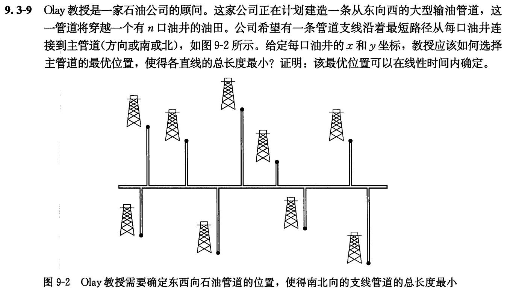

# 中位数和顺序统计量

## 9.1-1

Q：证明：在最坏情况下，找到$n$个元素中第二小的元素需要$n+\lceil\lg n\rceil-2$次比较。（提示：可以同时找最小元素。）

A：

```code
FIND-SECOND-MINIMAL(A, n):
    min, min2 = COMPARE(A[1], A[2])
    for i = 3 to n step 2:
        m, m2 = COMPARE(A[i], A[i+1])
        new-min = COMPARE(m, min)
        if new-min == m:
            min2 = min
            min = m
            min2 = COMPARE(min2, m2)
        else
            min2 = COMPARE(min2, m)
    if i < n:
        new-min = COMPARE(min, A[n])
        if new-min == min
            min2 = COMPARE(min2, A[n])
        else
            min2 = min
```

该算法的比较次数，包括第一对元素，每对元素比较一次$\lceil\lg n\rceil$，除第一对元素外，循环中每对元素比较两次$n-2$，如果元素个数是奇数，则循环结束时循环次数比元素个数为偶数少1，因此总比较次数少于偶数次循环。因此最坏情况下，找到$n$个元素中第二小的元素需要$n+\lceil\lg n\rceil-2$次比较。

--------------------

## 9.1-2

Q：证明：在最坏情况下，同时找到$n$个元素中最大值和最小值的比较次数的下界是$\lceil3n/2\rceil-2$。（提示：考虑有多少个数有成为最大值或最小值的潜在可能，然后分析一下每一次比较会如何影响这些计数。）

A：在任意$n$个元素中同时找最大值和最小值，那么对于这$n$个元素而言，假设有$n/2$的元素是潜在最小值可能，则剩下$n/2$的元素是潜在最大值可能，则需要对潜在可能的元素遍历比较，总共$n-2$次比较。任意其他划分总的比较次数与该划分一样。要得到该划分，需要对$n$个元素两两比较，将较小的元素划分到潜在最小值可能，而较大的元素划分到潜在最大值可能，总共需要$n/2$次比较。任意其他划分的比较次数$>n/2$次比较。因此最坏情况下，同时找到$n$个元素中最大值和最小值的比较次数下界是$\lceil3n/2\rceil-2$。

--------------------

## 9.2-1

Q：证明：在RANDOMIZED-SELECT中，对长度为0的数组，不会进行递归调用。

A：长度为$0$，则$p=r=0$，函数会在一开始就返回。

--------------------

## 9.2-2

Q：请讨论：指示器随机变量$X_k$和$T(max(k-1, n-k))$是独立的。

A：我们从程序中知道，影响指示器随机变量$X_k$值的过程在第3行，即划分后得到主元位置q。而影响$T(max(k-1, n-k))$值的过程在8行和9行。它们的发生是没有相互关系的，不论第3行得到什么样的结果对执行8行或9行中过程的时间没有影响，因此这两个变量是独立的。

--------------------

## 9.2-3

Q：给出RANDOMIZED-SELECT的一个基于循环的版本。

A：

```code
RANDOMIZED-SELECT(A,p,r,i):
    if p == r
        return A[p]
    q = RANDOMIZE-PARTITION(A,p,r)
    k = q - p + 1
    while i != k
        if i < k
            q = RANDOMIZED-PARTITION(A,p,q-1)
        else
            p = q + 1
            q = RANDOMIZED-PARTITION(A,q+1,r)
        k = q - p + 1
```

--------------------

## 9.2-4

Q：假设用RANDOMIZED-SELECT去选择数组$A=<3, 2, 9, 0, 7, 5, 4, 8, 6, 1>$的最小元素，给出能够导致RANDOMIZED-SELECT最坏情况发生的一个划分序列。

A：从9到1，每个数都刚好依次被选中作为主元，得到的划分$q$依次为$<10, 9, 8, 7, 6, 5, 4, 3, 2>$。

--------------------

## 9.3-1

Q：在算法SELECT中，输入元素被分为每组5个元素。如果它们被分为每组7个元素，该算法仍然会是线性时间吗？证明：如果分成每组3个元素，SELECT的运行时间不是线性的。

A：由同样的方法推得，如果被分为每组7个元素，选择$n \gt 112$且$c\geq 14a$能够使算法仍然是线性的。然而被分成每组3个元素的情况下，算法运行时间不是线性的。

--------------------

## 9.3-2

Q：分析SELECT，并证明：如果$n\geq 140$，则至少$\lceil n/4 \rceil$个元素大于中位数的中位数$x$，至少$\lceil n/4 \rceil$个元素小于$x$？

A：由之前推导的大于$x$的元素个数至少为：$3n/10 - 6$

$3n/10 - 6 \geq \lceil n/4 \rceil$

$3n/10 -6 \geq n/4 + 1$

$n/20 \geq 7$

$n \geq 140$

--------------------

## 9.3-3

Q：假设所有元素都是互异的，说明在最坏情况下，如何才能使快速排序的运行时间为$\Omicron(n\lg n)$。

A：在快速排序选取主元过程中，使用SELECT来保证每次选取的主元都是待排数据的中位数，这样快速排序的运行时间就能保证为$\Omicron(n\lg n)$。

--------------------

## 9.3-4

Q：对一个包含$n$个元素的集合，假设一个算法只使用比较来确定第$i$小的元素，证明：无需额外的比较操作，它也能找到第$i-1$小的元素和第$n-i$大的元素。

A：

--------------------

## 9.3-5

Q：假设你已经有了一个最坏情况下是线性时间的用于求解中位数的“黑箱”子程序。设计一个能在线性时间内解决任意统计量的选择问题算法。

A：设该黑箱子程序名为SELECT-BLACK

```code
FIND-ELEM(A, i):
    mid = SELECT-BLACK(A)
    if i == mid:
        return A[mid]
    let B, C be new array
    n = len(A)
    for i = 1 to n:
        if A[i] > A[mid]:
            add A[i] to array B
        elseif A[i] <= A[mid]:
            add A[i] to array C

    if i > mid:
        FIND-ELEM(C, i - mid)
    else
        FIND-ELEM(B, mid)

```

--------------------

## 9.3-6

Q：对一个包含$n$个元素的集合来说，$k$分位数是指能把有序集合分成$k$个等大小集合的第$k-1$个顺序统计量。给出一个能找出某一集合的$k$分位数的$\Omicron(n\lg k)$时间的算法。

A：


--------------------

## 9.3-7

Q：设计一个$\Omicron(n)$时间的算法，对于一个给定的包含$n$个互异元素的集合$S$和一个正整数$k\leq n$，该算法能够确定$S$中最接近中位数的$k$个元素。

A：先利用选择算法找到第$n/2-k/2$小的元素a，再找到第$n/2-k/2$大的元素b，然后遍历每一个元素通过比较其是否在[a, b]的区间内，即可在$\Omicron(n)$时间内确定最接近中位数的$k$个元素。

--------------------

## 9.3-8

Q：设$X[1..n]$和$Y[1..n]$为两个数组，每个都包含$n$个有序的元素。请设计一个$\Omicron(\lg n)$时间的算法来找出数组$X$和$Y$中所有$2n$个元素的中位数。

A：

--------------------

## 9.3-9

Q：



A：


--------------------
