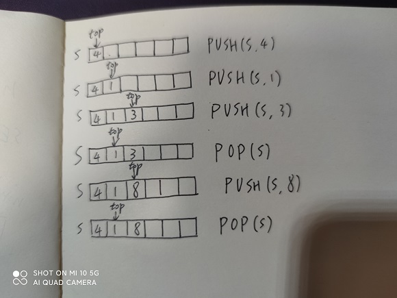
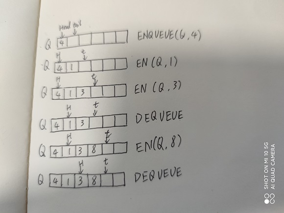
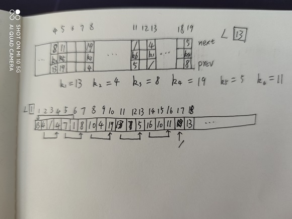
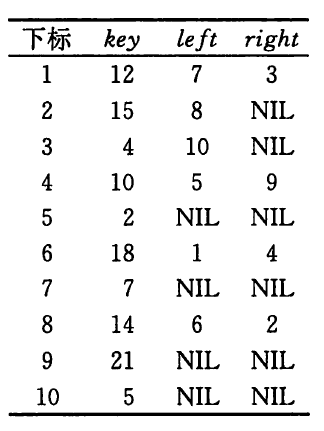
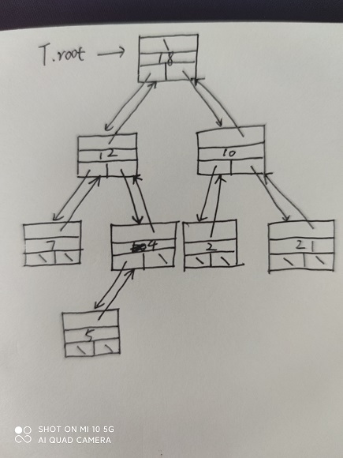
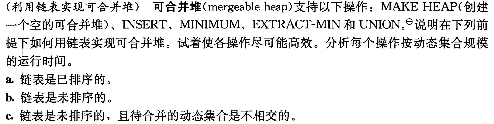
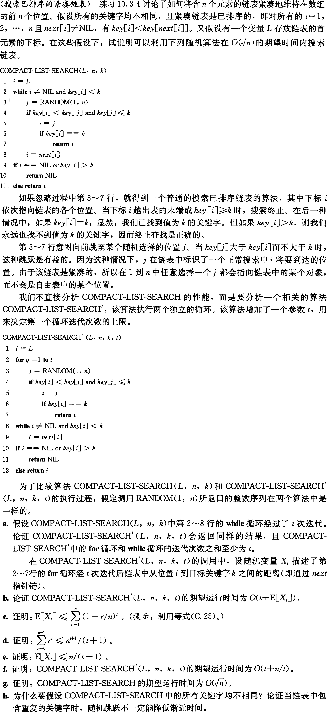

# 基本数据结构

## 10.1-1

Q：仿照图10-1，画图表示依次执行操作PUSH(S, 4)、PUSH(S, 1)、PUSH(S, 3)、POP(S)、PUSH(S, 8)和POP(S)每一步的结果，栈S初始为空，存储于数组S[1..6]中。

A：

---------------------------

## 10.1-2

Q：说明如何在一个数组A[1..n]中实现两个栈，使得当两个栈的元素个数之和不为$n$时，两者都不会发生上溢。要求PUSH和POP操作的运行时间为$\Omicron(1)$。

A：一个栈实现在数组的低位，top按栈元素个数递增，另一个栈实现在数组的高位，top按栈元素个数从$n$开始递减。

---------------------------

## 10.1-3

Q：仿照图10-2，画图表示依次执行操作ENQUEUE(Q, 4)、ENQUEUE(Q, 1)、ENQUEUE(Q, 3)、DEQUEUE(Q)、ENQUEUE(Q, 8)和DEQUEUE(Q)每一步的结果，队列初始为空，存储于数组Q[1..6]中。

A：

---------------------------

## 10.1-4

Q：重写ENQUEUE和DEQUEUE的代码，使之能处理队列的下溢和上溢。

A：

```code
ENQUEUE(Q, x)
    Q[Q.tail] = x
    if Q.tail == Q.length
        Q.tail = 1
    else Q.tail = Q.tail + 1
    if Q.tail == Q.head
        throw overflow
```

```code
DEQUEUE(Q)
    if Q.head == Q.tail
        throw underflow
    x = Q[Q.head]
    if Q.head == Q.length
        Q.head = 1
    else Q.head = Q.head + 1
    return x
```

---------------------------

## 10.1-5

Q：栈插入和删除元素只能在同一端进行，队列的插入操作和删除操作分别在两端进行，与它们不同的，有一种双端队列（deque），其插入和删除操作都可以在两端进行。写出4个时间均为$\Omicron(1)$的过程，分别实现在双端队列的两端插入和删除元素的操作，该队列是用一个数组实现的。

A：

```code
ENDEQUE_FRONT(Q, x)
    Q[Q.front] = x
    if Q.front == 1
        Q.front = Q.length
    else Q.front = Q.front - 1
    if Q.front == Q.end
        throw overflow
```

```code
DEDEQUE_FRONT(Q)
    if Q.front == Q.length
        Q.front = 1
    else Q.front = Q.front + 1
    if Q.front == Q.end
        throw underflow
    x = Q[Q.front]
    return x
```

```code
ENDEQUE_END(Q, x)
    Q[Q.end] = x
    if Q.end == Q.length
        Q.end = 1
    else Q.end = Q.end + 1
    if Q.front == Q.end
        throw overflow
```

```code
DEDEQUE_END(Q)
    if Q.end == 1
        Q.end = Q.length
    else Q.end = Q.end - 1
    if Q.front == Q.end
        throw underflow
    x = Q[Q.end]
    return x
```

---------------------------

## 10.1-6

Q：说明如何用两个栈实现一个队列，并分析相关队列操作的运行时间。

A：入队列操作为在栈1上PUSH；出队列操作需要进行条件判断，如果栈2为空，则依次将栈1中的元素POP并PUSH到栈2，并POP栈2顶端元素，否则直接POP栈2顶端元素。入队列操作时间为$\Omicron(1)$，出队列操作时间为$\Omicron(n)$或$\Omicron(1)$。

---------------------------

## 10.1-7

Q：说明如何用两个队列实现一个栈，并分析相关队列操作的运行时间。

A：将一个队列设为当前活动队列，入栈将元素ENQUEUE到当前活动队列；出栈时，将当前活动队列中的元素DEQUEUE并ENQUEUE到另一个队列中，直到当前活动队列中元素个数为1，将该元素视为出栈元素，并将当前活动队列设置为另一个队列。入栈时间为$\Omicron(1)$ ，出栈时间为$\Omicron(n)$。


---------------------------

## 10.2-1

Q：单链表上的动态集合操作INSERT能否在$\Omicron(1)$时间内实现？DELETE操作呢？

A：INSERT可以，DELETE不行。

---------------------------

## 10.2-2

Q：用一个单链表L实现一个栈。要求操作PUSH和POP的运行时间仍为$\Omicron(1)$。

A：

```code
PUSH(L, n)
    n.next = L.next
    L.next = n
```

```code
POP(L)
    result = L.next
    L.next = L.next.next
    return result
```

---------------------------

## 10.2-3

Q：用一个单链表L实现一个队列。要求操作ENQUEUE和DEQUEUE的运行时间仍为$\Omicron(1)$。

A：

增加一个指针指向单链表的尾结点

```code
ENQUEUE(L, n)
    L.tail.next = n
    L.tail = n
```

```code
DEQUEUE(L)
    result = L.next
    L.next = result.next
    return result
```

---------------------------

## 10.2-4

Q：如前所述，LIST-SEARCH'过程中的每一次循环迭代都需要两个测试：一是检查$x\neq L.nil$，另一个是检查$x.key \neq k$。试说明如何在每次迭代中省略对$x \neq L.nil$的检查。

A：将L.nil设置为一个key为k的结点，在最后判断x和L.nil是否为同一个结点即可。

---------------------------

## 10.2-5

Q：使用单向循环链表实现字典操作INSERT、DELETE和SEARCH，并给出所写过程的运行时间。

A：
```code
INSERT(L, x)
    x.next = L.nil.next
    L.nil.next = x
```

时间复杂度为$\Omicron(1)$。

```code    
DELETE(L, x)
    find = L.nil
    pre = find
    find = find.next
    while find != L.nil
        if find == x
            pre.next = find.next
            return
        pre = find
        find = find.next
```

时间复杂度为$\Omicron(n)$。

```code
SEARCH(L, key)
    search = L.nil.next
    while search != L.nil
        if search.key == key
            return search
        search = search.next
    return NIL
```

时间复杂度为$\Omicron(n)$。

---------------------------

## 10.2-6

Q：动态集合操作UNION以两个不相交的集合$S_1$和$S_2$作为输入，并返回集合$S=S_1\cup S_2$，包含$S_1$和$S_2$的所有元素。该操作通常会破坏集合$S_1$和$S_2$。试说明如何选用一种合适的表类数据结构，来支持$\Omicron(1)$时间的UNION操作。

A：双向循环链表，把两个链表的首尾分别连接起来构成一个包含$S_1$和$S_2$所有元素的双向循环链表。

---------------------------

## 10.2-7

Q：给出一个$\Theta(n)$时间的非递归过程，实现对一个含$n$个元素的单链表的逆转。要求除存储链表本身所需的空间外，该过程只能使用固定大小的存储空间。

A：用三个指针，分别指向单链表中顺序连接的三个结点，把前两个结点的链接反转，再将三个指针分别往原链表尾方向推一个位置，重复该过程直到最后一个指针指向NIL，此时反转前两个指针即可得到逆转的单链表。

---------------------------

## 10.2-8

Q：说明如何在每个元素仅使用一个指针$x.np$（而不是通常的两个指针$next$和$prev$）的情况下实现双向链表。假设所有指针的值都可视为$k$位的整型数，且定义$x.np=x.next XOR x.prev$，即$x.next$和$x.prev$的$k$位异或。（NIL的值用0表示。）注意要说明获取表头所需的信息，并说明如何在该表上实现SEARCH、INSERT和DELETE操作，以及如何在$\Omicron(1)$时间内实现该表的逆转。

A：

---------------------------

## 10.3-1

Q：画图表示序列<13, 4, 8, 19, 5, 11>，其存储形式为多数组表示的双向链表。同样画出单数组表示的形式。

A：

---------------------------

## 10.3-2

Q：对一组同构对象用单数组表示法实现，写出过程ALLOCATE-OBJECT和FREE-OBJECT。

A：

```code
ALLOCATE-OBJECT()
    if free == NIL
        error 'out of space'
    else
        x = free
        free = A[x+1]
        return x
```

```code
FREE-OBJECT(x)
    A[x+1] = free
    free = x
```

---------------------------

## 10.3-3

Q：在ALLOCATE-OBJECT和FREE-OBJECT过程的实现中，为什么不需要设置或重置对象的prev属性呢？

A：ALLOCATE-OBJECT不需要设置prev是因为，获取到的free结点插入到双向链表中时会按照插入位置初始化prev的值；FREE-OBJECT不需要重置prev是因为单链表没有使用prev中的值。

---------------------------

## 10.3-4

Q：我们往往希望双向链表的所有元素在存储器中保持紧凑，例如，在多数组表示中占用前$m$个下标位置。（在页式虚拟存储的计算环境下，即为这种情况。）假设除指向链表本身的指针外没有其他指针指向该链表的元素，试说明如何实现过程ALLOCATE-OBJECT和FREE-OBJECT，使得该表示保持紧凑。（提示：使用栈的数组实现。）

A：

维护一个指向已分配数组栈顶下标值m

```code
ALLOCATE-OBJECT()
    m = m + 1
    if m > A.length
        error 'out of space'
    else
        return m
```

```code
FREE-OBJECT(x)
    x.next = A[m].next
    x.prev = A[m].prev
    x.key = A[m].key
    m = m - 1
```

---------------------------

## 10.3-5

Q：设L是一个长度为$n$的双向链表，存储于长度为$m$的数组key、prev和next中。假设这些数组由维护双链自由表F的两个过程ALLOCATE-OBJECT和FREE-OBJECT进行管理。又假设$m$个元素中，恰有$n$个元素在链表L上，$m-n$个在自由表上。给定链表L和自由表F，试写出一个过程COMPACTIFY-LIST(L, F)，用来移动L中的元素使其占用数组中$1, 2, ..., n$的位置，调整自由表F以保持其正确性，并且占用数组中$n+1, n+2, ..., m$的位置。要求所写的过程运行时间应为$\Theta(n)$，且只使用固定量的额外存储空间。请证明所写的过程是正确的。

A：

```code
COMPACTIFY-LIST(L, F)
    next = L
    prev = nil
    next_f = F
    prev_f = nil
    while next != nil
        if next > n
            while next_f > n
                prev_f = next_f
                next_f = next_f.next
            prev_f.next = next
            prev.next = next_f
            exchange next_f.next with next.next
            next_f.key = next.key
            next_f.prev = next.prev
        prev = next
        next = next.next
```

可使用循环不变式证明，此处只给出形式化的证明。过程将每一个L中位置大于n的元素与F中位置小于或等于n的元素进行交换，并且保持L中该被交换元素prev结点的next下标正确性，以及F中该被交换元素prev结点的next下标正确性。因此循环结束后，L中元素占用数组$1, 2, ..., n$的位置，且F中元素占用数组$n+1, n+2, ..., m$的位置。

---------------------------

## 10.4-1

Q：画出下列属性表所示的二叉树，其根结点下标为6.



A：

---------------------------

## 10.4-2

Q：给定一个$n$结点的二叉树，写出一个$\Omicron(n)$时间的递归过程，将该树每个结点的关键字输出。

A：

```code
RECURSIVE-TRAVERSE(n)
    if n != NIL
        print n.key
        RECURSIVE-TRAVERSE(n.left)
        RECURSIVE-TRAVERSE(n.right)
```

---------------------------

## 10.4-3

Q：给定一个$n$结点的二叉树，写出一个$\Omicron(n)$时间的非递归过程，将该树每个结点的关键字输出。可以使用一个栈作为辅助数据结构。

A：

```code
NON-RECURSIVE-TRAVERSE(n)
    if n == NIL
        return
    PUSH(S, n)
    while S not empty
        elem = POP(S)
        print elem.key
        if elem.left != NIL
            PUSH(S, elem.left)
        if elem.right != NIL
            PUSH(S, elem.right)
```

---------------------------

## 10.4-4

Q：对于一个含$n$个结点的任意有根树，写出一个$\Omicron(n)$时间的过程，输出其所有关键字。该树以左孩子右兄弟表示法存储。

A：

```code
NON-RECURSIVE-TRAVERSE(n)
    if n == NIL
        return
    PUSH(S, n)
    while S not empty
        elem = POP(S)
        print elem.key
        if elem.left_child != NIL
            PUSH(S, elem.left_child)
        if elem.right_sibling != NIL
            PUSH(S, elem.right_sibling)
```

---------------------------

## 10.4-5 

Q：给定一个$n$结点的二叉树，写出一个$\Omicron(n)$时间的非递归过程，将该树每个结点的关键字输出。要求除该树本身的存储空间外只能使用固定量的额外存储空间，且在过程中不得修改该树，即使是暂时的修改也不允许。

A：

---------------------------

## 10.4-6

Q：任意有根树的左孩子右兄弟表示法中每个结点用到三个指针：left-child、right-sibling和parent。对于任何结点，都可以在常数时间到达其父节点，并在与其孩子数呈线性关系的时间内到达所有孩子结点。说明如何在每个结点中只使用两个指针和一个布尔值的情况下，使结点的父结点或者其所有孩子结点可以在与其孩子数呈线性关系的时间内到达。

A：

---------------------------

## 思考题10-1

Q：（链表间的比较）对于下表中的4种链表，所列的每种动态集合操作在最坏情况下的渐近运行时间是多少？

A：

||未排序的单链表|已排序的单链表|未排序的双向链表|已排序的双向链表|
|---|---|---|---|---|
|SEARCH(L, k)|$\Omicron(n)$|$\Omicron(n)$|$\Omicron(n)$|$\Omicron(n)$|
|INSERT(L, x)|$\Omicron(1)$|$\Omicron(n)$|$\Omicron(1)$|$\Omicron(n)$|
|DELETE(L, x)|$\Omicron(n)$|$\Omicron(n)$|$\Omicron(1)$|$\Omicron(1)$|
|SUCCESSOR(L, x)|$\Omicron(n)$|$\Omicron(n)$|$\Omicron(n)$|$\Omicron(n)$|
|PREDECESSOR(L, x)|$\Omicron(n)$|$\Omicron(n)$|$\Omicron(n)$|$\Omicron(n)$|
|MINIMUM(L)|$\Omicron(n)$|$\Omicron(1)$|$\Omicron(n)$|$\Omicron(1)$|
|MAXIMUM(L)|$\Omicron(n)$|$\Omicron(1)$|$\Omicron(n)$|$\Omicron(1)$|

---------------------------

## 思考题10-2

Q：



A：

此处假定链表是按非递减顺序排序。

||MAKE-HEAP|INSERT|MINIMUM|EXTRACT-MIN|UNION|
|---|---|---|---|---|---|
|a|-|遍历并比较链表元素查找插入位置|链表首元素|提取链表首元素|从待合并的两个链表表头开始，逐步比较元素大小，将较小的元素链接到合并链表的尾部，若遇到相同元素则只合并其中一个，抛弃另一个|
|a时间|$\Omicron(1)$|$\Omicron(n)$|$\Omicron(1)$|$\Omicron(1)$|$\Omicron(n)$|
|b|找到最小元素并放到链表头|如果待插入元素比表头元素小，则插入在表头，否则插入在表头之后|链表首元素|提取链表首元素，并找到剩余元素中最小元素放到链表头|与a大致相同，不同处在于合并后，原链表需要找到剩余元素中的最小元素放到表头|
|b时间|$\Omicron(n)$|$\Omicron(1)$|$\Omicron(1)$|$\Omicron(n)$|$\Omicron(n^2)$|
|c|与b一致|与b一致|与b一致|与b一致|直接比较待合并链表的表头，将表头较小的作为新表头，表头较大的链接到合并链表的末尾|
|c时间|$\Omicron(n)$|$\Omicron(1)$|$\Omicron(1)$|$\Omicron(n)$|$\Omicron(n)$|


---------------------------

## 思考题10-3

Q：



A：

---------------------------
