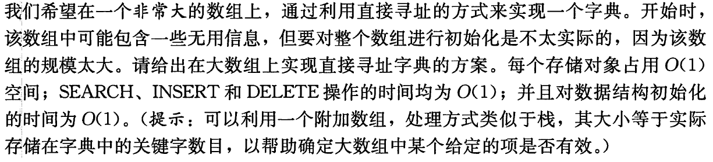
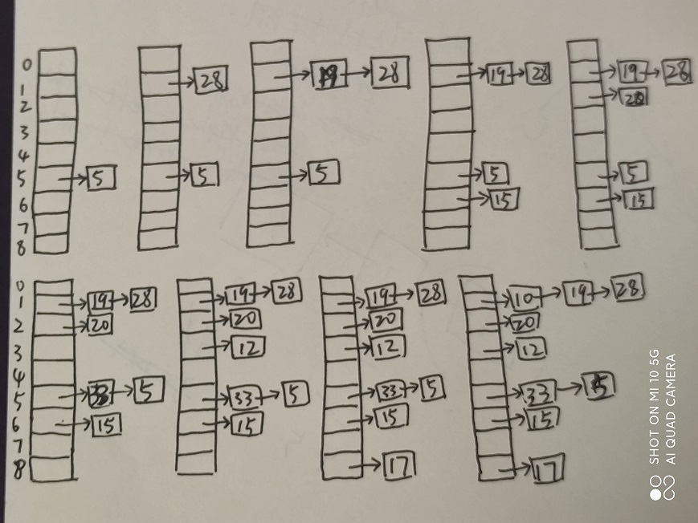

# 散列表

## 11.1-1

Q：假设一动态集合S用一个长度为$m$的直接寻址表T来表示。请给出一个查找S中最大元素的过程。你所给的过程在最坏情况下运行时间是多少？

A：从下标0到$m-1$逐一查看元素存在与否，并比较元素与记录的最大元素。最坏情况下运行时间为$\Omicron(m)$。

---------------------------

## 11.1-2

Q：位向量是一个仅包含0和1的数组。长度为$m$的位向量所占空间要比包含$m$个指针的数组少得多。请说明如何用一个位向量来表示一个包含不同元素（无卫星数据）的动态集合。字典操作的运行时间应为$\Omicron(1)$。

A：假设动态集合的最大元素为$m$，则申请一个有$m$位的位向量，用1代表该位的位数所对应的元素在动态集合内，0代表不在集合内。

---------------------------

## 11.1-3

Q：试说明如何实现一个直接寻址表，表中各元素的关键字不必都不相同，且各元素可以有卫星数据。所有三种字典操作（INSERT、DELETE和SEARCH）的运行时间应为$\Omicron(1)$。（不要忘记DELETE要处理的是被删除对象的指针变量，而不是关键字。）

A：根据最大关键字$m$建立一个大小$m$的数组，数组中每个位置指向一个记录相同关键字元素指针的链表。

---------------------------

## 11.1-4

Q：

A：

---------------------------

## 11.2-1

Q：假设用一个散列函数$h$将$n$个不同的关键字散列到一个长度为$m$的数组T中。假设采用的是简单均匀散列，那么期望的冲突数是多少？更准确地，集合$\{\{k, l\}: k \neq l，且h(k)=h(l)\}$的期望值是多少？

A：该集合中元素个数为$\frac{n^2-n}{2}$，单个元素满足条件，即指示器随机变量$X_{ij}=I\{h(k_i)=h(k_j)\}$，在简单均匀散列的假设下，有$E[X_{ij}]=1/m$，因此集合的期望值为$\frac{n^2-n}{2m}$。

---------------------------

## 11.2-2

Q：对于一个用链接法解决冲突的散列表，说明将关键字5，28，19，15，20，33，12，17，10插入到该表中的过程。设该表中有9个槽位，并设其散列函数为$h(k)=k \% 9$。

A：

---------------------------

## 11.2-3

Q：Marley教授做了这样一个假设，即如果将链模式改动一下，使得每个链表都能保持已排好序的顺序，散列的性能就可以有较大的提高。Marley教授的改动对成功查找、不成功查找、插入和删除操作的运行时间有何影响？

A：对删除的运行时间没有影响；插入的运行时间变为的$\Omicron(1+\alpha)$，此处$\alpha$代表链表的平均期望长度；成功查找和不成功查找的运行时间相同均为$\Omicron(1+\alpha)$。

---------------------------

## 11.2-4

Q：说明在散列表内部，如何通过将所有未占用的槽位链接成一个自由链表，来分配和释放元素所占的存储空间。假定一个槽位可以存储一个标志、一个元素加上一个或两个指针。所有的字典和自由链表操作均应具有$\Omicron(1)$的期望运行时间。该自由链表需要是双向链表吗？或者，是不是单链表就足够了呢？

A：需要是双向链表，因为字典操作需要$\Omicron(1)$的期望运行时间，即对于自由链表中的任意一个结点都需要分配为新的散列表元素，需要将其从自由链表中断开，并且标志为散列表元素。

---------------------------

## 11.2-5

Q：假设将一个具有$n$个关键字的集合存储到一个大小为$m$的散列表中。试说明如果这些关键字均源于全域$U$，且$|U|>nm$，则$U$中还有一个大小为$n$的子集，其由散列到同一槽位中的所有关键字构成，使得链接法散列的査找时间最坏情况下为$\Theta(n)$。

A：

---------------------------

## 11.2-6

Q：假设将$n$个关键字存储到一个大小为$m$且通过链接法解决冲突的散列表中，同时已知每条链的长度，包括其中最长链的长度$L$，请描述从散列表的所有关键字中均匀随机地选择某一元素并在$\Omicron(L\cdot({1+1/\alpha}))$的期望时间内返回该关键字的过程。

A：